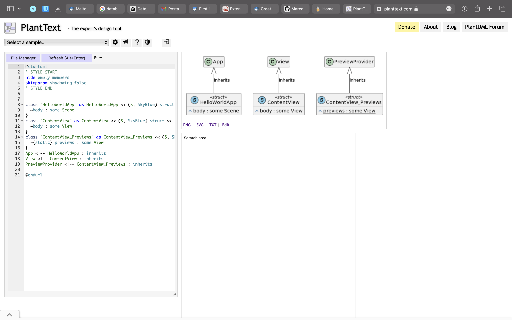

## Show your code in class diagrams

Sometimes it's very useful show your code to your commitments, maybe you need a simplified version of your code. You can automate this process with a simple script

## Steps 

The firs step is to download the script using brew. If you don't have installed brew on your pc you can follow this link : [install brew](https://brew.sh).

Once you have brew installed run this command on the terminal:

```
brew install swiftplantuml
```

## Create the graph

Now in the terminal move in the root folder of your project and run this command:

````
swiftplantuml
````

After that the browser will open with your graph, you can modify as you want and export in the format you prefer. 

## Result

The result will be like this

