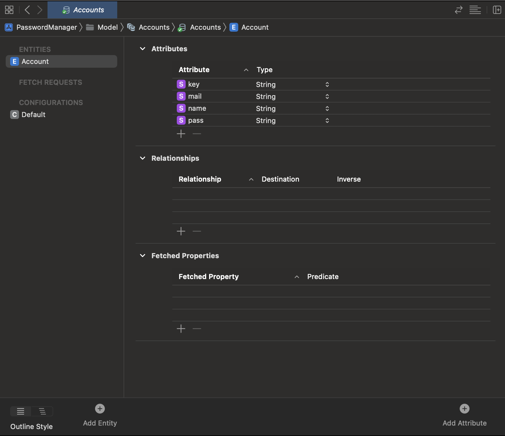

## What is CoreData

CoreData is maybe one of the basic framework that you need in order to get data persistance in your app.

The implementation could seem very complicated but if you understand how it works maybe it could be a little bit more clear. 
For this project we need different type of swift file, but we will see this and other stuff don't worry. Let's start


> Use Core Data to save your application’s permanent data for offline use, to cache temporary data, and to add undo functionality to your app on a single device. To sync data across multiple devices in a single iCloud account, Core Data automatically mirrors your schema to a CloudKit container. Through Core Data’s Data Model editor, you define your data’s types and relationships, and generate respective class definitions. Core Data can then manage object instances at runtime to provide the following features.


## Remember, import the library !

Open a new swift file (not swiftUI be careful), you can name it as you want. I called main **Persistance**
As usual the first step when we use a certain framework is import the library.

```swift
import CoreData
```

## The Controller

In order to work with our stored data we need a controller that work as a bridge between CoreData and our personal data structure. So in the file that you have created:


```swift
import Foundation

import CoreData

struct PersistenceController {
    static let shared = PersistenceController()
    
    let container: NSPersistentContainer
    init() {
        container = NSPersistentContainer(name: "Accounts")
        
        container.loadPersistentStores { (storeDescription, error) in
            if let error = error as NSError? {
                fatalError("Container load failed: \(error)")
            }
        }
    }
}

```

Let's see what is this "Controller" 

1. We have creaated a struct called PersistanceController, inside we define a constant that is an object of type PersistenceController()
2. Then we define the container (our box that will contain our database) and we initialize it defining the constant container with the Container Object
3. Then there are some control error


## The DataModel file

Inside the DataModel file we define the structure of the database. In other words how the data will be stored inside the database

Now if you never work with a database it's a little bit complex to work with data flow.

In the DataModel file we define an **entity** of the real world that could be an **Account** as for the example. Now we have to imagine what charaterize the entiy so its **attributes**.

**The entity account has as attributes Account_Name, mail, password for example**

So imagine that an user could have more than one account, how these will be stored ?


Account_Name | Mail | Password |
-------------|------|----------|
Apple | mail@domain.com| Secret |
Google | mail@domain.com| Secret |
McDonald's | mail@domain.com| Secret |
Microsoft | mail@domain.com| Secret |

So it works like a numbers file with rows and column

Now create a new DataModel file in your project, declare the entities and add attributes like this:




## Conncect the database with the View

Now that we have the structure of the database the new step is to pass the structure from the DataModel file to the view. So in the main file we have to add few line of code:


```swift
import SwiftUI

@main
struct PasswordManagerApp: App {
    let persistenceController = PersistenceController.shared
    var body: some Scene {
        WindowGroup {
            MainView().environment(\.managedObjectContext,
                        persistenceController.container.viewContext)
        }
    }
}

```

As you can see we declare the controller that we have build before and with the dot modifier is possible to connect the Controller to the View

## Import the database into SwiftUI file

Imagine that we want to display all our entities into a list, so we need a view that is connected to the database and display all the items. First see the code and then try to understend how it works:


```swift
import SwiftUI

struct ListView: View {
    
    
    @Environment(\.managedObjectContext) private var viewContext
    
    @FetchRequest(entity: Account.entity(), sortDescriptors: [])

    var accounts: FetchedResults<Account>

    @State var showDetails = false
    
    
    var body: some View {
        NavigationView{
            List {
                ForEach(accounts) { account in
                    NavigationLink {
                        Text(account.name!)
                        
                    } label: {
                        Text(account.name!)
                        }
                    
                }.onDelete(perform: deleteProducts)
            }.navigationTitle("Order List")
                
        }
    }
    }
```

So as you can see in the first lines of code there are some important statement:

```swift
1 @Environment(\.managedObjectContext) private var viewContext
2 @FetchRequest(entity: Account.entity(), sortDescriptors: [])
3 var accounts: FetchedResults<Account>
```

So in the line number 1 with @Enviroment if the value changes, SwiftUI updates any parts of your view that depend on the value.

The FetchRequest property wrapper is used to declare a FetchedResults property that provides a collection of Core Data managed objects to a SwiftUI view.

In the accounts variable we put the FetchRequest


## Display the entities

So now that we have all the object linked we can display our entities into a visual list:

```swift
var body: some View {
        NavigationView{
            List {
                ForEach(accounts) { account in
                    NavigationLink {
                        Text(account.name!)
                        
                    } label: {
                        Text(account.name!)
                        }
                    
                }.onDelete(perform: deleteProducts)
            }.navigationTitle("Order List")
                
        }
    }
```

In this case we have into the list some other stuff like a navigation view ecc... But the logic is the same.

## Work with the database

Is the moment to add data to store in our database but also delete some item. How??
We need some function:

```swift
private func addProduct() {
            
            withAnimation {
                let account = Account(context: viewContext)
                account.name = name
                account.mail = quantity
                account.pass = pass
                saveContext()
            }
        }
        
        private func saveContext() {
            do {
                try viewContext.save()
            } catch {
                let error = error as NSError
                fatalError("An error occured: \(error)")
            }
        }


 private func deleteProducts(offsets: IndexSet) {
        withAnimation {
            offsets.map { accounts[$0] }.forEach(viewContext.delete)
                saveContext()
            }
    }
```

## Conclusion

I think that this is what you have to know to start a project using CoreData. Remember this is a basic implementation with a single entity, but there are a lot of stuff that you can do like conncet entities between ecc...

The answer to the question "How can I go deep into this things" is one:

**Try, make errors, fix it and iterate 😎**


## Summary

### Persistence file

```swift
import Foundation

import CoreData

struct PersistenceController {
    static let shared = PersistenceController()
    
    let container: NSPersistentContainer
    init() {
        container = NSPersistentContainer(name: "Accounts")
        
        container.loadPersistentStores { (storeDescription, error) in
            if let error = error as NSError? {
                fatalError("Container load failed: \(error)")
            }
        }
    }
}

```
### DataModel file


### Your_Project_NameApp

```swift
import SwiftUI

@main
struct PasswordManagerApp: App {
    let persistenceController = PersistenceController.shared
    var body: some Scene {
        WindowGroup {
            MainView() .environment(\.managedObjectContext,
                                                  persistenceController.container.viewContext)
        }
    }
}

```

### The view that display all the item

```swift
//
//  ListView.swift
//  PasswordManager
//
//  Created by Matteo Altobello on 13/12/22.
//

import SwiftUI
import CryptoKit

struct ListView: View {
    
    
    @Environment(\.managedObjectContext) private var viewContext
    
    @FetchRequest(entity: Account.entity(), sortDescriptors: [])
    var accounts: FetchedResults<Account>
    @State var showDetails = false
    
    
    var body: some View {
        NavigationView{
            List {
                ForEach(accounts) { account in
                    NavigationLink {
                        Text(account.name!)
                        
                    } label: {
                        Text(account.name!)
                        }
                    
                }.onDelete(perform: deleteProducts)
            }.navigationTitle("Order List")
                
        }
    }
    
    private func saveContext() {
        do {
            try viewContext.save()
        } catch {
            let error = error as NSError
            fatalError("An error occured: \(error)")
        }
    }
    
    
    private func deleteProducts(offsets: IndexSet) {
        withAnimation {
            offsets.map { accounts[$0] }.forEach(viewContext.delete)
                saveContext()
            }
    }
    
    
}

struct ListView_Previews: PreviewProvider {
    static var previews: some View {
        ListView()
    }
}

```